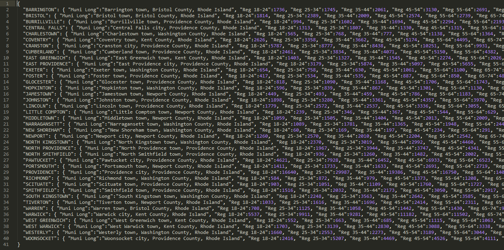
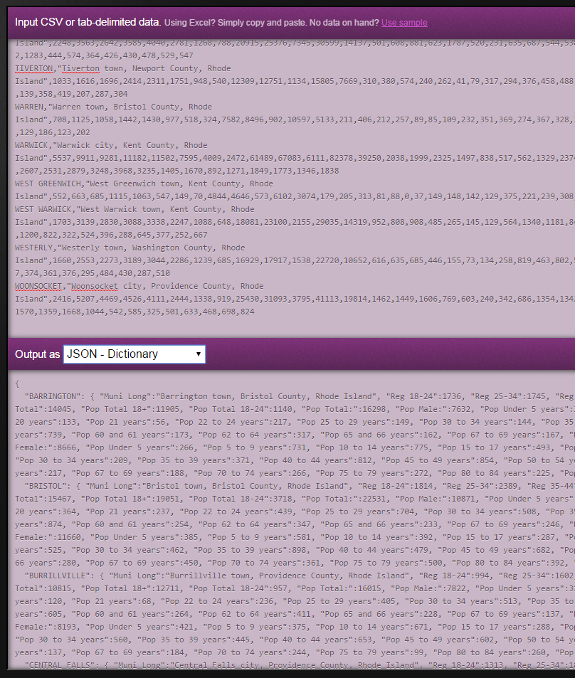

[View this map in action](http://www.gregjd.com/sandbox/interactive_map/interactive_map.html)

The intention of this is for people who don't know much about programming to be able to create an interactive map of Rhode Island municipalities based on a given dataset. In order to minimize development time (and also allow for easy customization), this does not involve creating a GUI. Note that this map offers a constrained set of display choices. This is deliberate, as a map that needs to be very different from this is probably better off being coded from scratch. This is meant to be especially useful for the kind of maps that we often need to make at ProvPlan, not just any map.

The code currently posted is for a specific project and dataset. A newer version will soon be posted that can accept a configuration object and any dataset, and display either Rhode Island municipalities or Providence neighborhoods.

## Directions

You'll need to make sure your data is in JSON format, as an object whose keys are municipality names (all caps) and values are objects whose keys are property names and values are property values. Here's an example:

Getting data from Excel or a CSV into this format is easy. You could certainly run a script that will do this automatically, but you can also do it through a website called [Mr. Data Converter](https://shancarter.github.io/mr-data-converter/). In the top box, paste your data. (It can take data straight from Excel, or as comma-separated or tab-separated values.) In the menu above the bottom box, select _"JSON - Dictionary."_ Your reformatted data is below!

If the data you started with was already in the right format, then you don't need to worry about converting it.

To-do: Add the rest of the directions!